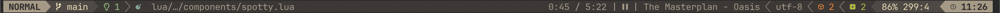
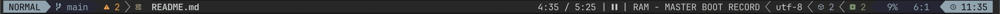
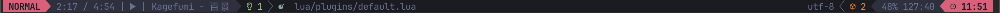

# Spotty.nvim

Display your current playstate, track/artist/duration within the lualine plugin.





___

## Warning

This project is in very much early alpha or whatever and is expected to present alot of bugs, so I do not recommend its use if you are looking for a completely stable development environment as of now.

Please report any and all bugs as this helps me iron out this small plugin.

### Installation

Requires Lualine and Plenary for Neovim:

```lua
'nvim-lualine/lualine.nvim'
'nvim-lua/plenary.nvim'
```

Install with your preferred package manager.

```lua
'externalhost0/spotty.nvim'
```

Adding two environmental variables is **REQUIRED** for the plugin to function!
As Spotty relies on a Spotify app and the user's client & secret keys.

Creating a Spotify App can be done at their developer dashboard: <https://developer.spotify.com/dashboard>

```bash
export SPOTIFY_CLIENT_ID = "your spotify client id"
export SPOTIFY_CLIENT_SECRET = "your spotify client secret"
```

### Setup

In your lualine configuration just add the component "spotty", this may look something like:

```lua
sections = {
    lualine_x = {
        {
            "spotty"
        },
    }
}
```

I provide a couple options for some extra customization inside lualine
( not implemented yet)

```lua
opts = {

}
```
